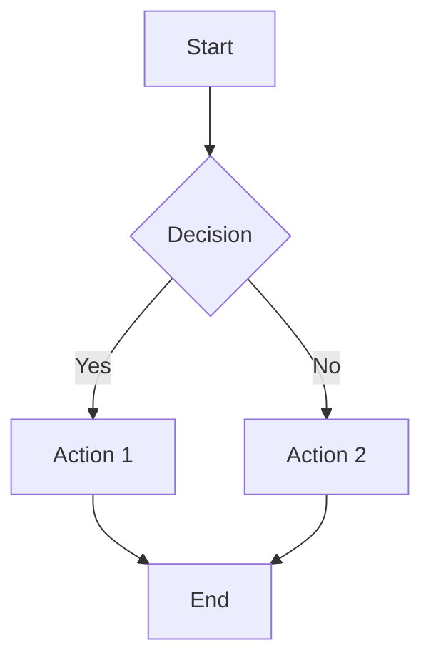

# Sample Presentation

Generated by Slidev-AI

---

## Overview

This is a sample presentation to demonstrate Slidev-AI capabilities.

- AI-powered generation
- Smart editing
- Diagram support
- Layout detection

---

## Features

### AI Generation
Generate complete presentations from topics

### Smart Editing
Edit slides with natural language instructions

### Diagrams
Auto-generate Mermaid diagrams

---

## Example Diagram

---

## Getting Started

1. Install the CLI
2. Set your API key
3. Run `slidev-ai new <topic>`
4. Open with Slidev

---

## Thank You!

Learn more at [github.com/slidev-ai](https://github.com)

