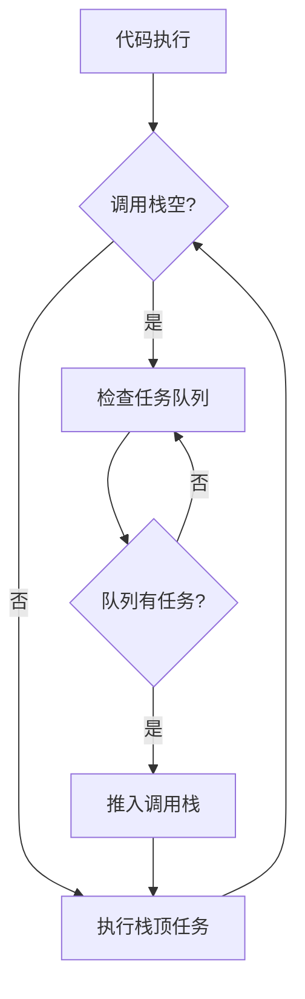

# JavaScript 事件循环
## 深入理解异步编程的核心机制

---
layout: intro
---

# 议程

- 什么是事件循环？
- JavaScript 运行时环境
- 调用栈、Web APIs、任务队列
- 宏任务与微任务
- 代码示例与执行顺序
- 实际应用与注意事项
- 总结

---
layout: two-cols
---

# 什么是事件循环？

- JavaScript 单线程执行模型的核心
- 协调代码执行、用户交互、网络请求
- 实现非阻塞异步行为的关键机制
- 持续检查调用栈和任务队列
- 确保高响应性的应用程序

::right::



---
layout: default
---

# JavaScript 运行时环境

- **调用栈 (Call Stack)**: 执行同步代码，后进先出
- **Web APIs**: 浏览器提供的异步功能接口
- **回调队列 (Callback Queue)**: 存储待处理的回调函数
- **事件循环 (Event Loop)**: 协调各部分的调度器
- **微任务队列 (Microtask Queue)**: 优先级高于回调队列

---
layout: two-cols
---

# 宏任务 vs 微任务

## 宏任务 (Macrotasks)
- `setTimeout` / `setInterval`
- I/O 操作
- UI 渲染
- `setImmediate` (Node.js)

## 执行顺序规则
1. 执行一个宏任务
2. 执行所有微任务
3. 如有需要，进行UI渲染
4. 开始下一个宏任务

::right::

## 微任务 (Microtasks)
- `Promise.then` / `catch` / `finally`
- `MutationObserver`
- `queueMicrotask`
- `process.nextTick` (Node.js)

```javascript
console.log('1. 同步代码');

setTimeout(() => {
  console.log('6. 宏任务');
}, 0);

Promise.resolve()
  .then(() => console.log('4. 微任务 1'))
  .then(() => console.log('5. 微任务 2'));

console.log('2. 同步代码');
queueMicrotask(() => console.log('3. 微任务'));
```

---
layout: default
---

# 代码执行顺序分析

```javascript
console.log('脚本开始');

setTimeout(() => console.log('setTimeout'), 0);

Promise.resolve()
  .then(() => {
    console.log('Promise 1');
    return Promise.resolve();
  })
  .then(() => console.log('Promise 2'));

console.log('脚本结束');
```

**预期输出顺序:**
1. 脚本开始
2. 脚本结束
3. Promise 1
4. Promise 2
5. setTimeout

---
layout: image-right
image: https://images.unsplash.com/photo-1555066931-4365d14bab8c?ixlib=rb-4.0.3&auto=format&fit=crop&w=800&q=80
---

# 实际应用与注意事项

- **避免阻塞事件循环**: 长时间同步任务会冻结UI
- **合理使用微任务**: 更新状态，避免不必要的渲染
- **理解执行时机**: 网络请求、动画帧、用户输入
- **Node.js 差异**: `process.nextTick` 优先级最高
- **调试技巧**: 使用浏览器Performance工具分析

**最佳实践:**
- 将CPU密集型任务拆解
- 使用Web Workers处理后台任务
- 优先使用微任务进行状态更新

---
layout: center
---

# 总结

- 事件循环是JS异步编程的基石
- 理解调用栈、任务队列的协作
- 掌握宏任务与微任务的执行优先级
- 编写高效、响应迅速的应用程序
- 持续学习运行时环境的新特性

## 深入学习
- MDN Web Docs: Concurrency model and Event Loop
- Node.js官方文档: The Node.js Event Loop
- JavaScript可视化工具: loupe