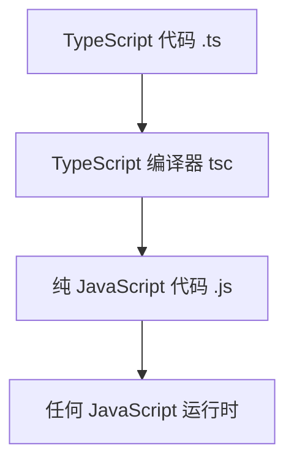

# TypeScript 介绍

现代 JavaScript 的超集

---
layout: intro
---

# 议程

- TypeScript 是什么？
- 核心特性与优势
- 类型系统详解
- 开发环境配置
- 实际应用示例
- 总结与展望

---
layout: two-cols
---

# TypeScript 是什么？

- **JavaScript 的超集**
- 添加了**静态类型系统**
- 编译为纯 JavaScript 代码
- 由 Microsoft 开发与维护
- 支持所有 JS 库和框架

::right::



---
layout: default
---

# 核心特性与优势

- **静态类型检查** - 在编译时捕获错误
- **增强的 IDE 支持** - 智能提示与重构
- **渐进式采用** - 可逐步添加类型
- **面向对象特性** - 类、接口、泛型
- **现代 ES 特性** - 支持最新 ECMAScript 标准

---
layout: two-cols
---

# 类型系统基础

```typescript
// 基本类型注解
let name: string = "TypeScript";
let age: number = 10;
let isActive: boolean = true;

// 数组与元组
let numbers: number[] = [1, 2, 3];
let tuple: [string, number] = ["Alice", 30];

// 接口定义
interface User {
  id: number;
  name: string;
  email?: string; // 可选属性
}
```

::right::

# 高级类型特性

- **联合类型** - `string | number`
- **交叉类型** - `TypeA & TypeB`
- **泛型** - 可重用组件类型
- **类型推断** - 自动推导类型
- **类型守卫** - 运行时类型检查

```typescript
// 泛型示例
function identity<T>(arg: T): T {
  return arg;
}

// 类型别名
type Point = {
  x: number;
  y: number;
};
```

---
layout: default
---

# 开发环境配置

1. **安装 TypeScript**
   ```bash
   npm install -g typescript
   ```

2. **初始化项目**
   ```bash
   tsc --init
   ```

3. **配置 tsconfig.json**
   ```json
   {
     "compilerOptions": {
       "target": "ES2020",
       "module": "ESNext",
       "strict": true
     }
   }
   ```

4. **集成构建工具**
   - Webpack + ts-loader
   - Vite / Rollup 插件
   - Babel + @babel/preset-typescript

---
layout: image-right
image: https://images.unsplash.com/photo-1555066931-4365d14bab8c?w=600&auto=format&fit=crop
---

# 实际应用场景

## 企业级项目
- 大型前端应用维护
- 团队协作开发规范
- 代码质量与可维护性

## 流行框架支持
- **Angular** - 内置 TypeScript 支持
- **React** - 通过 @types/react
- **Vue 3** - 原生 TypeScript 集成
- **Node.js** - 后端 API 开发

## 工具链生态
- VS Code 深度集成
- ESLint + TypeScript
- Jest 测试框架支持

---
layout: center
class: text-center
---

# 总结

## TypeScript 的核心价值

- **提升代码质量** - 类型安全减少运行时错误
- **改善开发体验** - 智能工具链支持
- **促进团队协作** - 清晰的接口定义
- **拥抱未来标准** - 持续演进的语言特性

## 开始使用

```bash
# 今天就开始你的 TypeScript 之旅
npm init -y
npm install typescript --save-dev
```

**JavaScript that scales.**